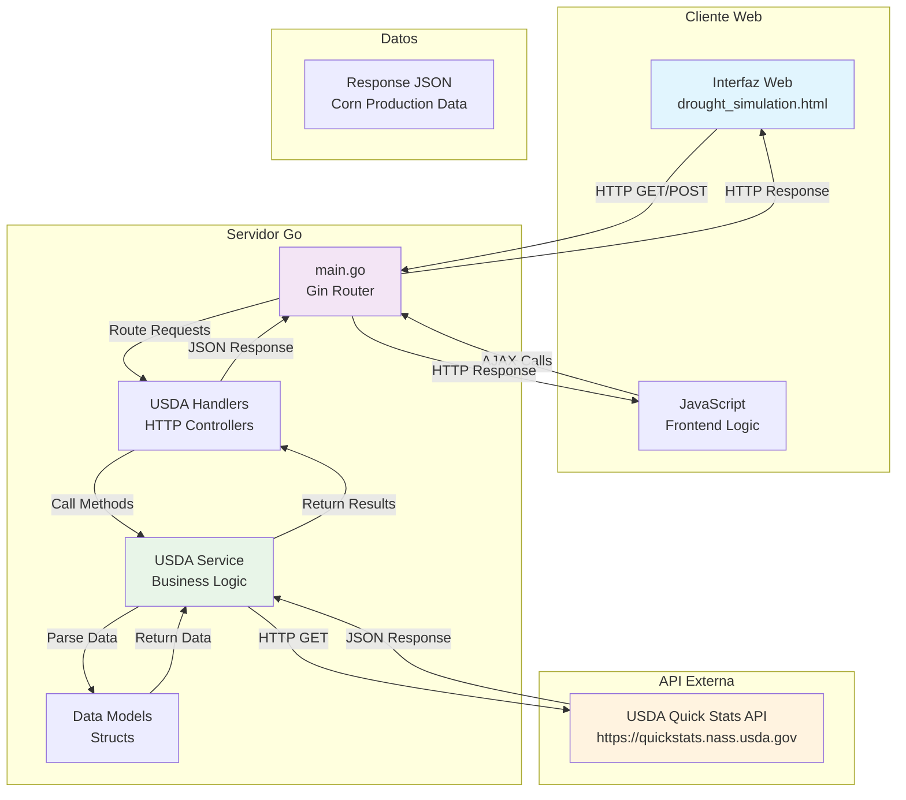
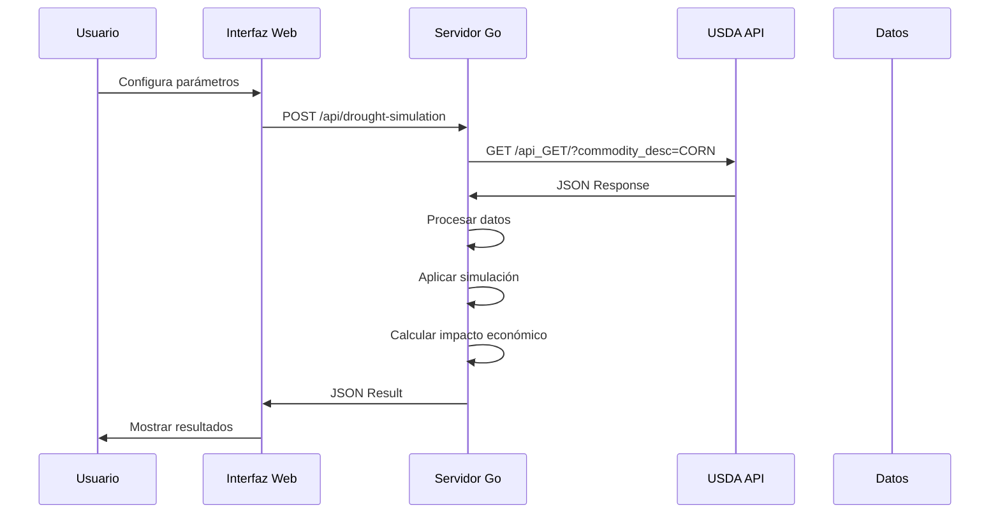
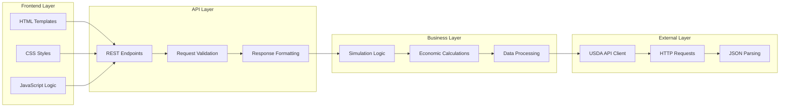
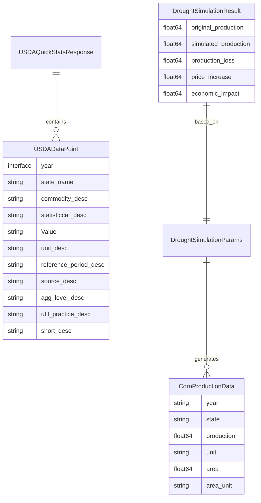
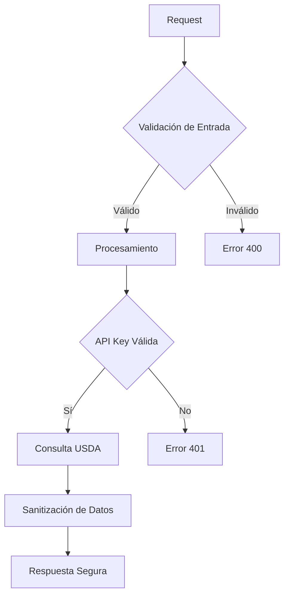
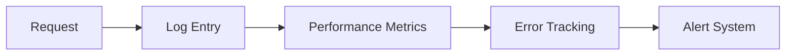
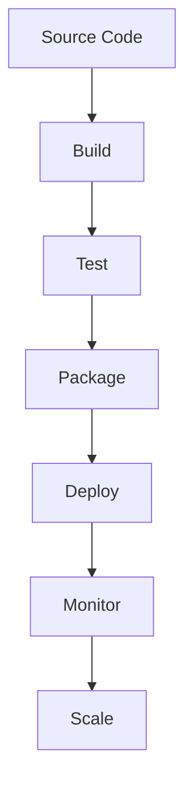

# 🏗️ Arquitectura del Sistema

## Diagrama de Arquitectura

## Flujo de Datos

## Estructura de Componentes

## Modelo de Datos

## Patrones de Diseño Utilizados

### 1. **MVC (Model-View-Controller)**
- **Model**: `internal/models/usda.go`
- **View**: `templates/drought_simulation.html`
- **Controller**: `internal/handlers/usda_handlers.go`

### 2. **Service Layer Pattern**
- **Service**: `internal/services/usda_service.go`
- **Responsabilidad**: Lógica de negocio y comunicación con API externa

### 3. **Repository Pattern** (Simplificado)
- **Data Access**: Manejo de datos de USDA API
- **Abstracción**: Separación de lógica de datos

### 4. **Dependency Injection**
- **Handlers**: Reciben servicios como dependencias
- **Services**: Reciben configuración como dependencias

## Consideraciones de Seguridad

## Escalabilidad

### Horizontal
- Múltiples instancias del servidor
- Load balancer
- Caché compartido (Redis)

### Vertical
- Optimización de consultas a API
- Caché de respuestas
- Compresión de datos

## Monitoreo y Logging

## Deployment

